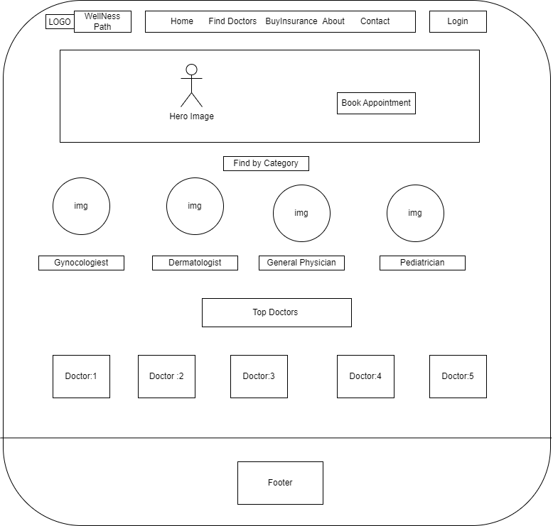
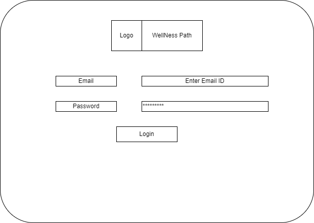
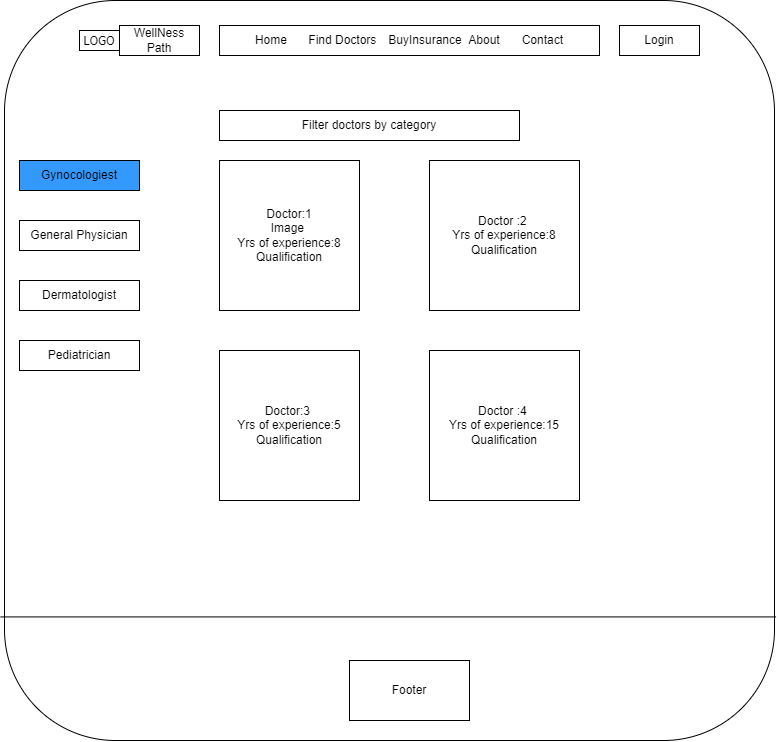
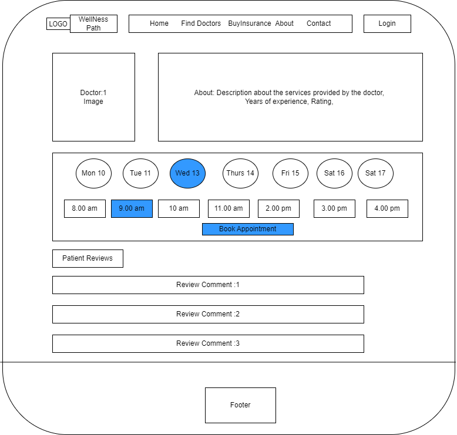
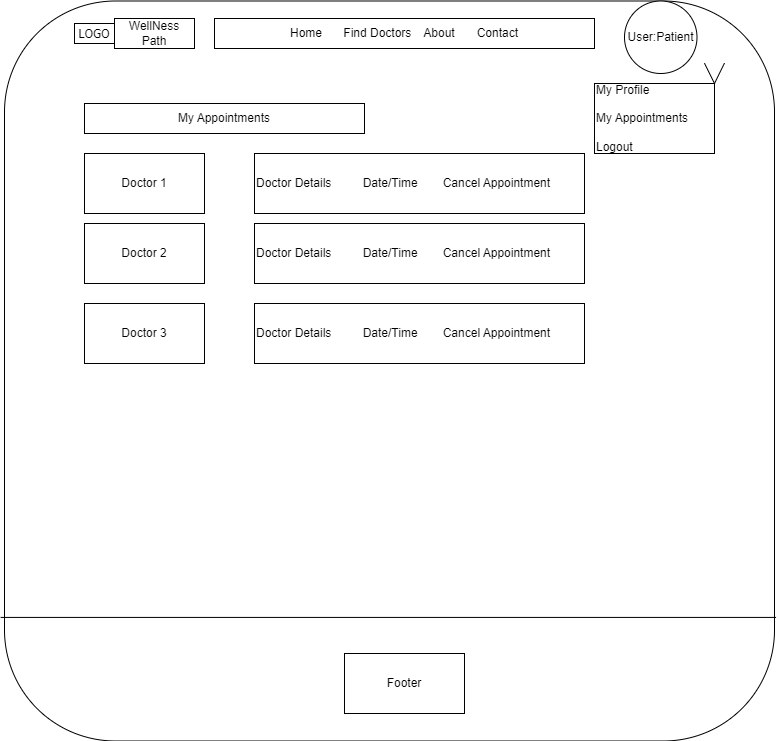
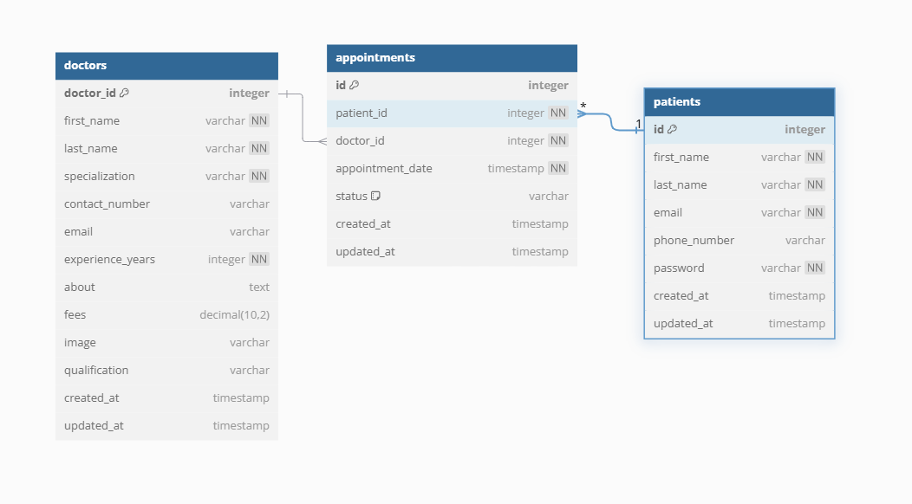

# Project Title
***Wellness Path***

## Overview

**Wellness Path** is a web application designed to streamline hospital operations, focusing primarily on patient management, appointment scheduling, and health report access. The application aims to enhance efficiency in healthcare settings by providing a centralized platform for managing essential patient data.

### Problem Space

Hospitals often struggle with managing patient information, scheduling appointments, and accessing health reports through manual or fragmented systems. These challenges can lead to errors, inefficiencies, and delays in patient care. This application addresses these issues by integrating these functionalities into a single, user-friendly platform.

### User Profile

The primary user of this application is the Patient.

Patients can:
    -Schedule and cancel appointments.
    -Choose doctors based on their specialties.
    - Visit patients profile and edit their information
    - View patients upcoming appointments.

Special considerations include ensuring data privacy and compliance with HIPAA healthcare regulations.


### Features

-**User Authentication:** Secure login for patients.
-**Appointment Scheduling:** Schedule, view, and cancel patient appointments.
-**Doctor Selection:** Browse and select doctors based on categories.
-**Health Reports:** Access and view health reports.

## Implementation

### Tech Stack

- React
- JavaScript
- Tailwind CSS
- SaSS, BEM
- MySQL
- Express
- Client libraries: 
    - react
    - axios
    - react-toastify
    - dotenv
    - react-dom
    - react-router-dom 
   
- Server libraries:
    - knex
    - express
    - express-validator
    - mysql2
    - cors
    - JWT for authentication and authorization, maintaining user sessions securely and allowing users to grant access to their data.

### APIs

- No External API's used for this sprint.

### Sitemap

- **Home Page:** Overview and login options.
- **Login Page** Allows Patients to Login
- **DoctorsbyCategory:** Gives the list of doctors for each category. User Profile: *Patient*
- **DoctorsbyID:** Gives the details of the doctor and available time for appoinment booking. User profile: *Patient*
- **Appointment Management:** Lists booked appointments and allows cancellations.


### Mockups

#### Home Page


#### Login Page


#### DoctorsbyCategory


#### DoctorsbyID


#### Appointment Management



#### Data


### Endpoints

List endpoints that your server will implement, including HTTP methods, parameters, and example responses.

**1. User Endpoints :**
**-POST /api/patients/register** - Description: Create a new user(patient).

Request Body:
```
[
    {
    "first_name": "John",
    "last_name": "Doe",
    "phone_number": "1234567890",
    "email": "john.doe@example.com",
    "password": "securepassword"
  }
    ...
]
```
Response:
```
    {
  {
    "success": true,
    "message": "User registered successfully",
    "token": "your_jwt_token_here"
}
    }
```
**-POST - /api/patients/login** - Description :  Log in an existing user (patient).
Request
```
{
    "email": "john.doe@example.com",
    "password": "securepassword"
}
```
Response
```
{
    "success": true,
    "message": "Login successful",
    "token": "your_jwt_token_here"
}
```

**GET /api/patients/get-profile** -Description: Retrieve the profile of the logged-in user.
Header:
```
Header: your_jwt_token_here
```

Response
```
{
    "id": 1,
    "first_name": "John",
    "last_name": "Doe",
    "phone_number": "1234567890",
    "email": "john.doe@example.com"
}
```
**PUT /api/patients/update-profile** - Description: Update the profile of the logged-in user.
Header:
```
Header: your_jwt_token_here
```
Request
```
{
    "first_name": "John",
    "last_name": "Doe",
    "phone_number": "0987654321",
    "email": "john.doe@example.com"
}
```
Response
```
{
    "message": "Patient updated successfully"
}
```


**2. Appointment Endpoints**
**POST /api/appointments** -Description: Schedule a new appointment.
Request
```
{
 {
    "patientId": 1,
    "doctorId": 1,
    "dateTime": "2024-10-20T10:00:00"
}
}
```
Response
```
{
 "message": "Appointment created successfully."
}
```
**GET /api/appointments/my-appointment** - Description:  Retrieve all appointments for the authenticated patient.
Response
```
[
    {
        "image": "doctor_image_url",
        "specialization": "Cardiology",
        "appointment_date": "2024-10-20T10:00:00",
        "doctor_name": "Dr. Smith",
        "status": "scheduled",
        "id": 1
    },
    {
        "image": "doctor_image_url",
        "specialization": "Neurology",
        "appointment_date": "2024-10-22T09:00:00",
        "doctor_name": "Dr. Johnson",
        "status": "scheduled",
        "id": 2
    }
]
```
**GET /api/appointments/:doctorId/:date** - Description: Retrieve booked appointment times for a specific doctor on a specific date.
Request Parameters:

  doctorId: ID of the doctor.
  date: The date for which to retrieve appointments (format: YYYY-MM-DD).

Response
```
[
    "10:00 AM",
    "11:00 AM"
]
```
**PATCH /api/appointments/cancel/:appointmentId**  - Description: Cancel a specific appointment by ID.
Request Parameters:

appointmentId: ID of the appointment to be canceled.

Response
```
{
    "message": "Appointment canceled successfully."
}
```

**3.Doctor Endpoints**

**GET /api/doctors** - Description: Retrieve a list of all doctors.
Response
```
[
  {
    "doctor_id": 1,
    "first_name": "Jane",
    "last_name": "Smith",
    "specialization": "Cardiology",
    "contact_number": "0987654321",
    "email": "jane@example.com",
    "experience_years": 10,
    "created_at": "2024-10-15T12:00:00Z",
    "updated_at": "2024-10-15T12:00:00Z"
  },
  {
    "doctor_id": 2,
    "first_name": "John",
    "last_name": "Doe",
    "specialization": "Dermatology",
    "contact_number": "1234567890",
    "email": "john@example.com",
    "experience_years": 8,
    "created_at": "2024-10-15T12:00:00Z",
    "updated_at": "2024-10-15T12:00:00Z"
  }
]
```
**GET /api/doctors/:docId** - Description: Retrieve a specific doctor by ID.
Response
```
{
  "doctor_id": 1,
  "first_name": "Jane",
  "last_name": "Smith",
  "specialization": "Cardiology",
  "contact_number": "0987654321",
  "email": "jane@example.com",
  "experience_years": 10,
  "created_at": "2024-10-15T12:00:00Z",
  "updated_at": "2024-10-15T12:00:00Z"
}
```
**GET /api/doctors/specialization/:specialization** -Description : Retrieve a list of doctors who specialize in a specific field.
Request Paramerters:
  Specialization
Response
```
[
    {
        "doctor_id": 1,
        "name": "Dr. Smith",
        "specialization": "Cardiology",
        "phone": "123-456-7890",
        "email": "dr.smith@example.com"
    }
]
```


## Roadmap

-Week 1: Project Setup and Core Features
    
    -Day 1-2: Project Initialization

        -Create Client: Set up a React project with initial routing and boilerplate pages (Home, Login, Dashboard).
        -Create Server: Set up an Express server with basic routing.
        -Implement Placeholder Responses: Set up 200 responses for initial endpoints.

    -Day 3: Database Setup

        -Create Migrations: Define migrations for the database schema.
        -Define Database Schema: Set up tables for users, patients, appointments, and health reports.
        -Create Seeds: Populate the database with sample data for testing.

    -Day 4-5: User Authentication

        Feature: User Registration
            -Implement user registration page and form.
            -Create POST /api/users endpoint for new user creation.

        Feature: User Login
            -Implement login page and form.
            -Create POST /api/users/login endpoint for user authentication.

    -Day 6-7: Patient Management

        Feature: Patient Management
            -Implement functionalities to add, update, and delete patients.
            -Create corresponding API endpoints (POST, PUT, DELETE) for patients.

-Week 2: Appointment Scheduling and Finalization
    
    -Day 8-10: Appointment Scheduling

        Feature: Schedule Appointments
            -Implement functionality for patients to schedule appointments.
            -Create a form and POST /api/appointments endpoint.

        Feature: View Appointments
            -Implement functionality for users to view their appointments.
            -Create GET /api/appointments endpoint to retrieve appointments.

    -Day 11: UI Enhancements

        -UI Polish: Improve user interfaces for usability (styling and responsiveness).
                    Implement client-side validations for forms.

    -Day 12-13: Deployment and Final Adjustments
        Deploy Client and Server

        -Deploy both client and server applications to a cloud provider.
        Ensure all changes are reflected in production.

        Site wide testing and Bug Fixes

        -Address any bugs and implement final adjustments.

    -Day 14: DEMO DAY
        Prepare presentation materials and a live demo of the application.
        Showcase key features, user flows, and technology stack used.

## Future Implementations

**Role Based Authorization** - Add Admin and Doctor User Profiles.
**External APIs:** Potential integration with insurance claim submission APIs like Aetna / Anthem API.
**Insurance Management:** Manage insurance providers, policies, and claims.
**Claims Submission:** Submit and track insurance claims electronically.
**Testing** Write unit tests for critical components and API endpoints.


[def]: DBSchema.png