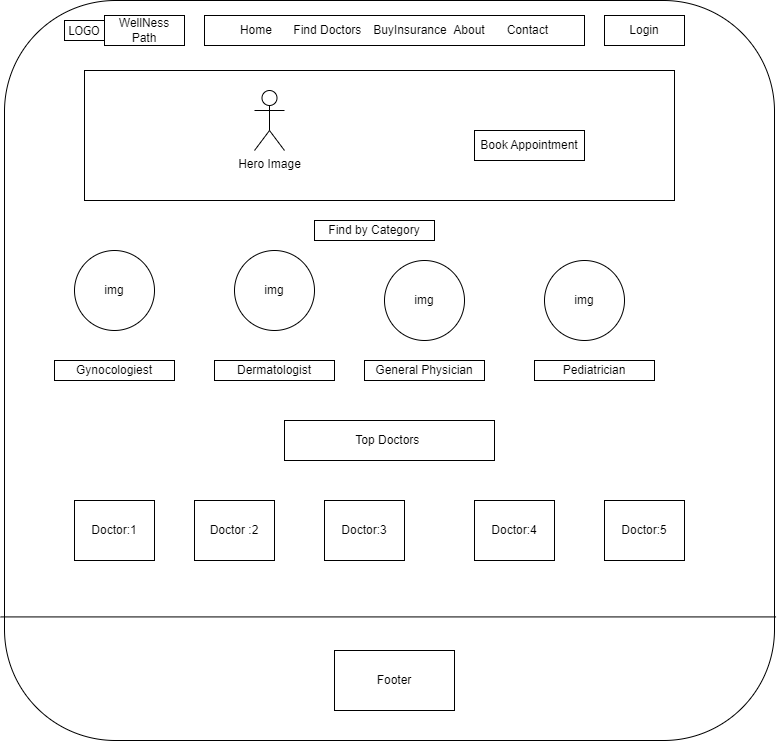
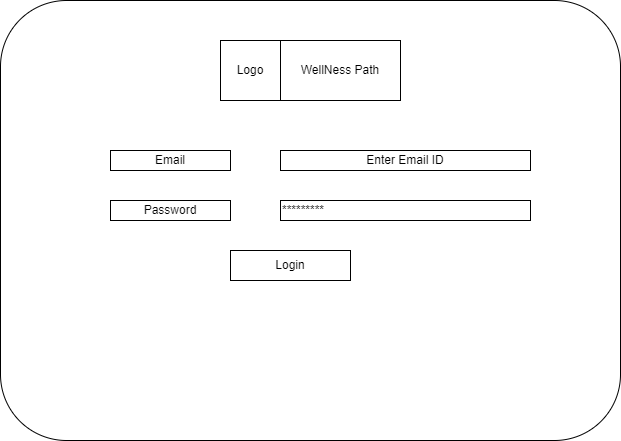
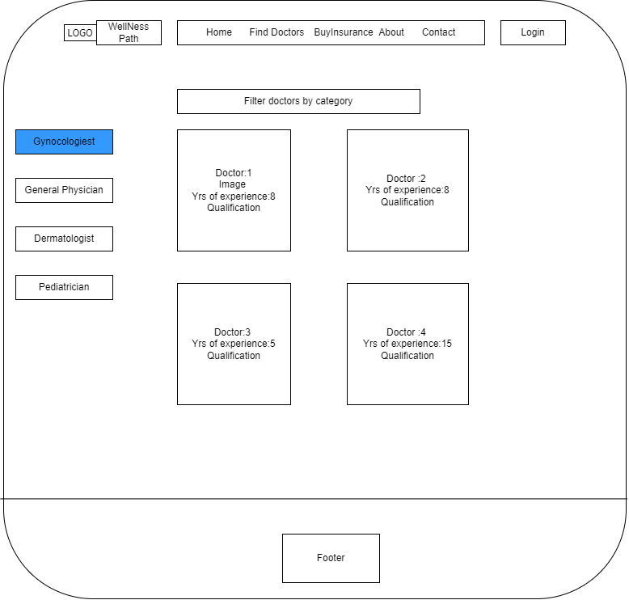
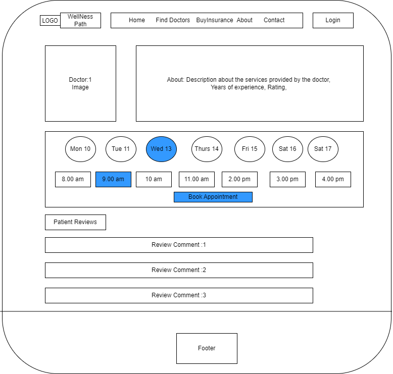
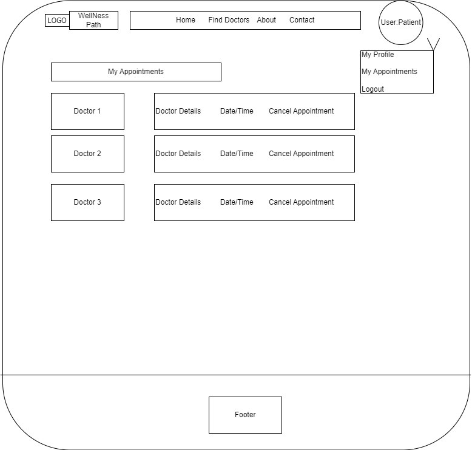
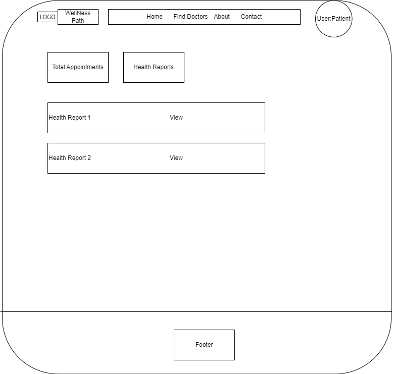
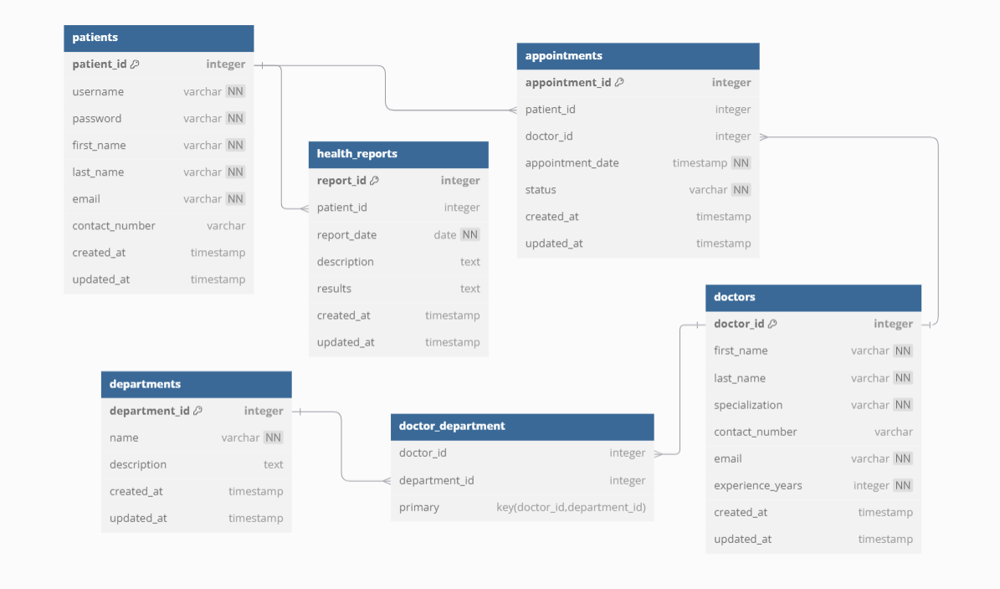

# Project Title
***Wellness Path***

## Overview

**Wellness Path** is a web application designed to streamline hospital operations, focusing primarily on patient management, appointment scheduling, and health report access. The application aims to enhance efficiency in healthcare settings by providing a centralized platform for managing essential patient data.

### Problem Space

Hospitals often struggle with managing patient information, scheduling appointments, and accessing health reports through manual or fragmented systems. These challenges can lead to errors, inefficiencies, and delays in patient care. This application addresses these issues by integrating these functionalities into a single, user-friendly platform.

### User Profile

The primary user of this application is the Patient.

Patients can:
    -Schedule and cancel appointments.
    -Choose doctors based on their specialties.
    -View their health reports.

Special considerations include ensuring data privacy and compliance with HIPAA healthcare regulations.


### Features

-**User Authentication:** Secure login for patients.
-**Appointment Scheduling:** Schedule, view, and cancel patient appointments.
-**Doctor Selection:** Browse and select doctors based on categories.
-**Health Reports:** Access and view health reports.

## Implementation

### Tech Stack

- React
- TypeScript
- MySQL
- Express
- Client libraries: 
    - react
    - react-router
    - axios
- Server libraries:
    - knex
    - express
    - OAuth 2.0 for authorization, allowing users to grant access to their data.
    - JWT for authentication, maintaining user sessions securely.

### APIs

- No External API's used for this sprint.

### Sitemap

- **Home Page:** Overview and login options.
- **Login Page** Allows Patients to Login
- **DoctorsbyCategory:** Gives the list of doctors for each category. User Profile: *Patient*
- **DoctorsbyID:** Gives the details of the doctor and available time for appoinment booking. User profile: *Patient*
- **Appointment Management:** Lists booked appointments and allows cancellations.
- **Health Reports:** Displays patient health reports.


### Mockups

#### Home Page


#### Login Page


#### DoctorsbyCategory


#### DoctorsbyID


#### DoctorsAppointment


#### Appointment Management


#### Health Reports


#### Data


### Endpoints

List endpoints that your server will implement, including HTTP methods, parameters, and example responses.

**1. User Endpoints :**
**-POST /api/users** - Description: Create a new user(patient).

Request Body:
```
[
    { 
        "username": "john_doe",
        "password": "securepassword",
        "role": "patient"
    },
    ...
]
```
Response:
```
    {
  "user_id": 1,
  "username": "john_doe",
  "role": "patient",
  "created_at": "2024-10-15T12:00:00Z",
  "updated_at": "2024-10-15T12:00:00Z"
    }
```
**-GET /api/users** -Description: Retrieve a list of users.
Response
```
[
  {
    "user_id": 1,
    "username": "john_doe",
    "role": "patient",
    "created_at": "2024-10-15T12:00:00Z",
    "updated_at": "2024-10-15T12:00:00Z"
  },
  {
    "user_id": 2,
    "username": "jane_admin",
    "role": "admin",
    "created_at": "2024-10-15T12:00:00Z",
    "updated_at": "2024-10-15T12:00:00Z"
  }
]
```
**GET /api/users/** -Description: Retrieve a specific user by ID.

Response
```
{
  "user_id": 1,
  "username": "john_doe",
  "role": "patient",
  "created_at": "2024-10-15T12:00:00Z",
  "updated_at": "2024-10-15T12:00:00Z"
}
```
**PUT /api/users/** - Description: Update a specific user.
Request
```
{
  "username": "john_doe_updated",
  "role": "patient"
}
```
Response
```
{
  "user_id": 1,
  "username": "john_doe_updated",
  "role": "patient",
  "created_at": "2024-10-15T12:00:00Z",
  "updated_at": "2024-10-16T12:00:00Z"
}
```
**DELETE /api/users/** - Description: Delete a specific user.
Response
```
{
  "message": "User deleted successfully."
}
```

**2. Appointment Endpoints**
**POST /api/appointments** -Description: Schedule a new appointment.
Request
```
{
  "patient_id": 1,
  "doctor_id": 2,
  "appointment_date": "2024-10-20T10:00:00Z",
  "status": "scheduled"
}
```
Response
```
{
  "appointment_id": 1,
  "patient_id": 1,
  "doctor_id": 2,
  "appointment_date": "2024-10-20T10:00:00Z",
  "status": "scheduled",
  "created_at": "2024-10-15T12:00:00Z",
  "updated_at": "2024-10-15T12:00:00Z"
}
```
**GET /api/appointments** - Description: Retrieve a list of appointments.
Response
```
[
  {
    "appointment_id": 1,
    "patient_id": 1,
    "doctor_id": 2,
    "appointment_date": "2024-10-20T10:00:00Z",
    "status": "scheduled",
    "created_at": "2024-10-15T12:00:00Z",
    "updated_at": "2024-10-15T12:00:00Z"
  },
  {
    "appointment_id": 2,
    "patient_id": 1,
    "doctor_id": 3,
    "appointment_date": "2024-10-21T11:00:00Z",
    "status": "scheduled",
    "created_at": "2024-10-16T12:00:00Z",
    "updated_at": "2024-10-16T12:00:00Z"
  }
]
```
**GET /api/appointments/** - Description: Retrieve a specific appointment by ID.
Response
```
{
  "appointment_id": 1,
  "patient_id": 1,
  "doctor_id": 2,
  "appointment_date": "2024-10-20T10:00:00Z",
  "status": "scheduled",
  "created_at": "2024-10-15T12:00:00Z",
  "updated_at": "2024-10-15T12:00:00Z"
}
```
**PUT /api/appointments/**  - Description: Update a specific appointment.
Request
```
{
  "status": "completed"
}
```
Response
```
{
  "appointment_id": 1,
  "status": "completed",
  "updated_at": "2024-10-16T12:00:00Z"
}
```
**DELETE /api/appointments/** - Description: Delete a specific appointment.
Response
```
{
  "message": "Appointment deleted successfully."
}
```


**3.Doctor Endpoints**

**GET /api/doctors** - Description: Retrieve a list of doctors.
Response
```
[
  {
    "doctor_id": 1,
    "first_name": "Jane",
    "last_name": "Smith",
    "specialization": "Cardiology",
    "contact_number": "0987654321",
    "email": "jane@example.com",
    "experience_years": 10,
    "created_at": "2024-10-15T12:00:00Z",
    "updated_at": "2024-10-15T12:00:00Z"
  },
  {
    "doctor_id": 2,
    "first_name": "John",
    "last_name": "Doe",
    "specialization": "Dermatology",
    "contact_number": "1234567890",
    "email": "john@example.com",
    "experience_years": 8,
    "created_at": "2024-10-15T12:00:00Z",
    "updated_at": "2024-10-15T12:00:00Z"
  }
]
```
**GET /api/doctors/** - Description: Retrieve a specific doctor by ID.
Response
```
{
  "doctor_id": 1,
  "first_name": "Jane",
  "last_name": "Smith",
  "specialization": "Cardiology",
  "contact_number": "0987654321",
  "email": "jane@example.com",
  "experience_years": 10,
  "created_at": "2024-10-15T12:00:00Z",
  "updated_at": "2024-10-15T12:00:00Z"
}
```

**4. Health Report Endpoints** 
**GET /api/reports** - Description: Retrieve a list of health reports for the patient.
Response
```
[
  {
    "report_id": 1,
    "patient_id": 1,
    "report_date": "2024-10-10",
    "description": "Routine health check-up.",
    "results": "All values within normal range.",
    "created_at": "2024-10-10T12:00:00Z",
    "updated_at": "2024-10-10T12:00:00Z"
  },
  {
    "report_id": 2,
    "patient_id": 1,
    "report_date": "2024-10-12",
    "description": "Blood test results.",
    "results": "Iron levels slightly low.",
    "created_at": "2024-10-12T12:00:00Z",
    "updated_at": "2024-10-12T12:00:00Z"
  }
]
```
**GET /api/reports/** - Description: Retrieve a specific health report by ID.
Response
```
{
  "report_id": 1,
  "patient_id": 1,
  "report_date": "2024-10-10",
  "description": "Routine health check-up.",
  "results": "All values within normal range.",
  "created_at": "2024-10-10T12:00:00Z",
  "updated_at": "2024-10-10T12:00:00Z"
}
```

**Department Endpoints**

**GET /api/departments** - Description: Retrieve a list of departments.
Response:
```
[
  {
    "department_id": 1,
    "name": "Cardiology",
    "description": "Heart and blood vessel specialists.",
    "created_at": "2024-10-15T12:00:00Z",
    "updated_at": "2024-10-15T12:00:00Z"
  },
  {
    "department_id": 2,
    "name": "Dermatology",
    "description": "Skin specialists.",
    "created_at": "2024-10-15T12:00:00Z",
    "updated_at": "2024-10-15T12:00:00Z"
  }
]
```
**GET /api/departments/** - Description: Retrieve a specific department by ID.
Response:
```
{
  "department_id": 1,
  "department_name": "Cardiology",
  "description": "Heart-related treatments and care.",
  "created_at": "2024-10-15T12:00:00Z",
  "updated_at": "2024-10-15T12:00:00Z"
}
```


**8.Doctor-Department Link Endpoints**

**GET /api/doctor_department** - Description: Retrieve a list of doctor-department links.
Response
```
[
  {
    "doctor_id": 1,
    "department_id": 1
  }
]
```

## Roadmap

-Week 1: Project Setup and Core Features
    
    -Day 1-2: Project Initialization

        -Create Client: Set up a React project with initial routing and boilerplate pages (Home, Login, Dashboard).
        -Create Server: Set up an Express server with basic routing.
        -Implement Placeholder Responses: Set up 200 responses for initial endpoints.

    -Day 3: Database Setup

        -Create Migrations: Define migrations for the database schema.
        -Define Database Schema: Set up tables for users, patients, appointments, and health reports.
        -Create Seeds: Populate the database with sample data for testing.

    -Day 4-5: User Authentication

        Feature: User Registration
            -Implement user registration page and form.
            -Create POST /api/users endpoint for new user creation.

        Feature: User Login
            -Implement login page and form.
            -Create POST /api/users/login endpoint for user authentication.

    -Day 6-7: Patient Management

        Feature: Patient Management
            -Implement functionalities to add, update, and delete patients.
            -Create corresponding API endpoints (POST, PUT, DELETE) for patients.

-Week 2: Appointment Scheduling and Finalization
    
    -Day 8-9: Appointment Scheduling

        Feature: Schedule Appointments
            -Implement functionality for patients to schedule appointments.
            -Create a form and POST /api/appointments endpoint.

        Feature: View Appointments
            -Implement functionality for users to view their appointments.
            -Create GET /api/appointments endpoint to retrieve appointments.

    -Day 10: Health Reports Access

        Feature: Health Reports
            -Implement functionality for patients to view their health reports.
            -Create GET /api/reports endpoint for retrieving reports.

    -Day 11: UI Enhancements

        -UI Polish: Improve user interfaces for usability (styling and responsiveness).
                    Implement client-side validations for forms.

    -Day 12-13: Deployment and Final Adjustments
        Deploy Client and Server

        -Deploy both client and server applications to a cloud provider.
        Ensure all changes are reflected in production.

        Site wide testing and Bug Fixes

        -Address any bugs and implement final adjustments.

    -Day 14: DEMO DAY
        Prepare presentation materials and a live demo of the application.
        Showcase key features, user flows, and technology stack used.

## Future Implementations

**Role Based Authorization** - Add Admin and Doctor User Profiles.
**External APIs:** Potential integration with insurance claim submission APIs like Aetna / Anthem API.
**Insurance Management:** Manage insurance providers, policies, and claims.
**Claims Submission:** Submit and track insurance claims electronically.
**Testing** Write unit tests for critical components and API endpoints.


[def]: DBSchema.png